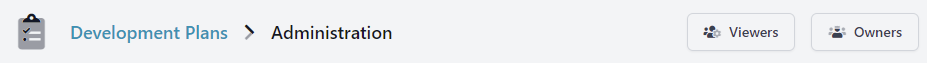
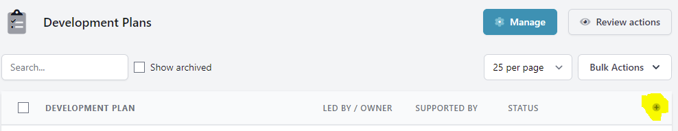
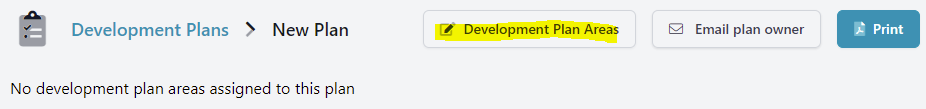
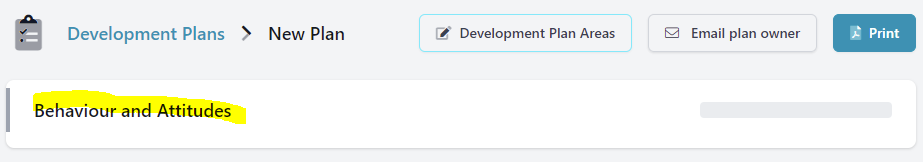
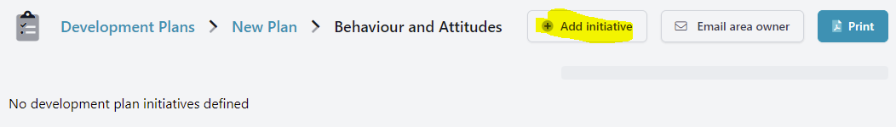
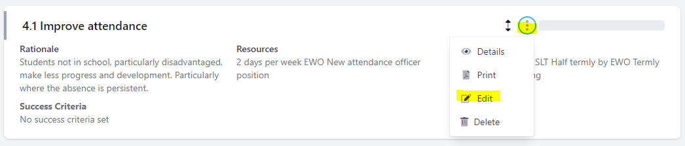
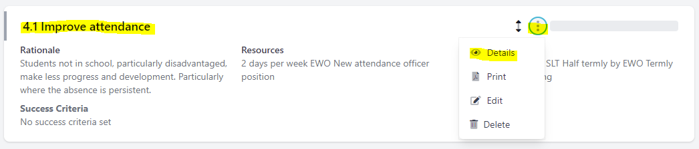
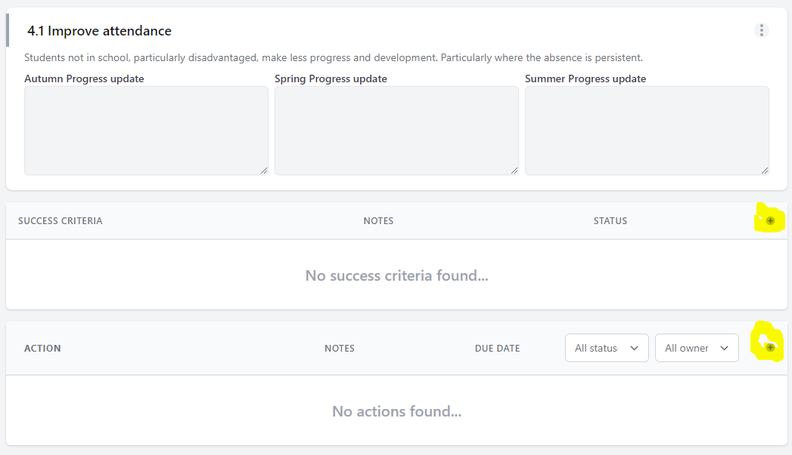
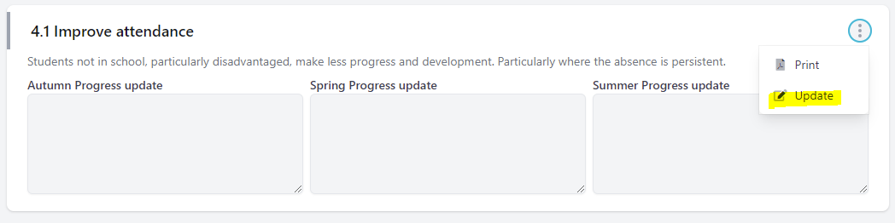

## Setup

1. An `Administrator` must enable the `Development Plan` Module in the Administration section of the system.

2. An `Administrator` should then assign the role of `Development Plan Manager` to one or more users of the system.

3. An `Administrator` or `Development Plan Manager` should assign the role of `Development Plan Owner` to other members of staff. Doing so means that they can then be assigned ownership of individual `Development Plans`, `Development Plan Areas`, `Initiatives` and `Actions`.

4. A `Development Plan Manager` should create new `Development Themes`.

5. A `Development Plan Manager` should create a new `Development Plan` (or copy an existing one\*\*) and assign `Development Areas` from the available `Themes`.

6. A `Development Plan Manager` should assign an `Owner`, and optionally a `Supporter` to each `Area`. The default `Owner` is the `Manager` who created the `Area`.
7. `Area` `Owners and Supporters` should then create `Initiatives` for their own `Area` and assign `Owners and Supporters` to these intiatives.

8. `Initiative` `Owners and Supporters` can then add `Rationale`, `Monitoring` and `Resources` to their `Initiatives`.

9. `Initiative` `Owners and Supporters` can then add `Success Criteria` and `Actions` to their `Initiatives` from the details page. This can be accessed from the menu or directly from the initiative name.

10. `Action` `Owners` can update the completion `Status` of their actions and add `Notes` to them too.

11. `Initiative` `Owners` can add termly progress updates if required.

