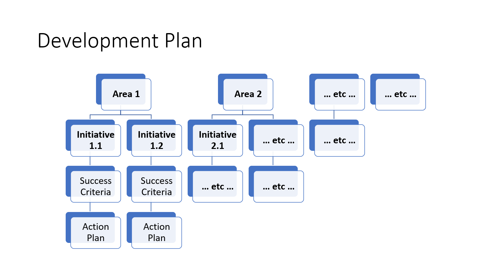
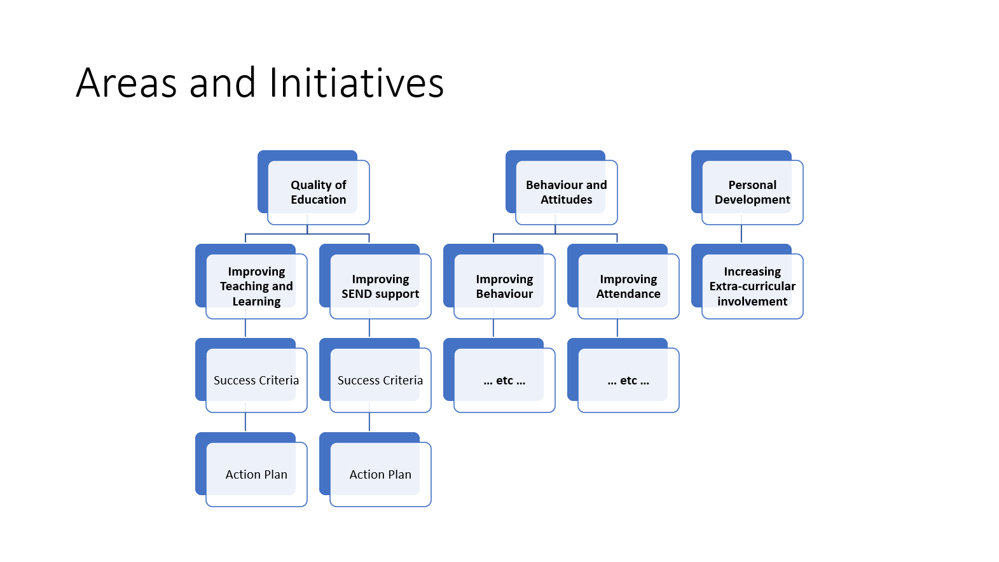
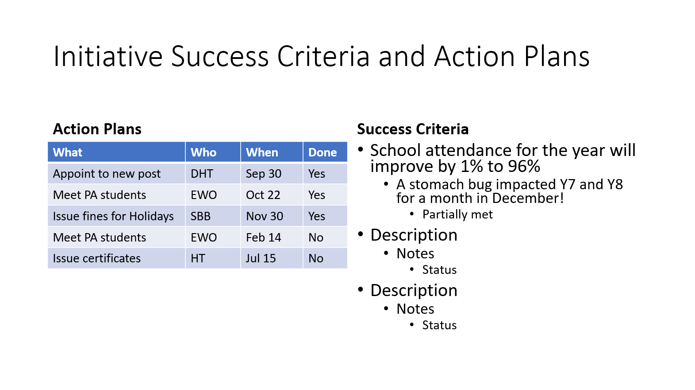
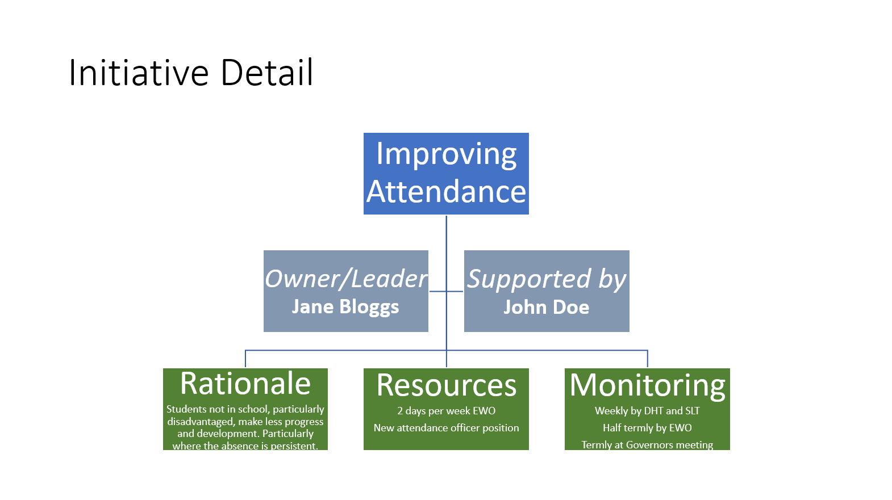
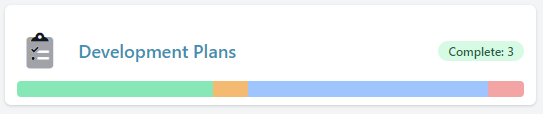
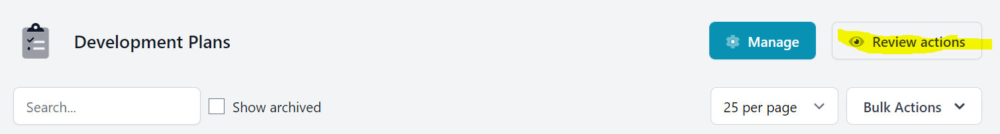
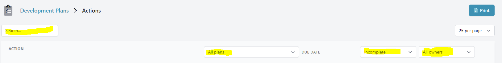

import ModuleIntroCards from '/snippets/module-intro-cards.mdx';

<ModuleIntroCards/>

## Introduction

This module enables the creation and maintenance of multiple `Development Plans` for the school.

Each `Development Plan` can have multiple `Development Areas` selected from a set of common `Development Themes` created
for the school.

<Tip>
    In a multi school system the central `Development Themes` are available and a `Development Manager` can also add
    new `Development Themes`.
</Tip>

`Development Areas` have one or more `Development Initiatives`.

<Info>
    Initiatives are the key elements of any plan. Areas/themes provide a way to group them together. Some
    schools do this using Inspection headings, other might use a different structure.
</Info>

Each `Development Initiative` summarises a key area of activity over the year and contains:

-   General information about `Rationale`, `Resources` and `Monitoring` as well as who is responsible for the initiative.
-   One or more `Success Criteria` which can be marked as `Not started`, `In progress`, `Not met`, `Partially met`
or `Met`. Each of these `Success Criteria` can be annotated with `Notes`.
-   Optional `Progress updates` three times a year.
-   `Actions` to be carried out by named staff by particular dates. Each `Action` can be annotated and marked
as `Complete`. As their `Due date` approaches they are displayed as `Due` when within 14 days and as `Overdue` when
the `Due date` has passed.

<Tip>
    The `Rationale`, `Resources` and `Monitoring` give a high level summary which is particularly useful to
    governors.
</Tip>

Each `Development Plan`, `Development Area` and `Development Initiative` has an `Owner` and may, optionally, have
a `Supporter` i.e. a second `Owner` with similar editing rights.
Each `Development Action` also has an `Owner`.

`Owners` and `Supporters` have editing rights to the level below them but not above. For example,
a `Development Area Owner` can edit all `Initiatives` and `Actions` in their `Area` but not the `Plan` overall or
other `Initiatives` and `Actions` in their plan.

Anyone who is an `Owner` or `Supporter` of any element of a `Development Plan` can view and print out all other plans in
full detail. It is also possible to assign the role of `Development Viewer` to any system user which wll give them
access to view but not edit any `Plan`.

-   Users with access to view `Development Plans` will have a panel visible on their Dashboard that summarises the status
of all the `Actions` in all the school `Plans`.
-   For `Owners and Managers` this panel also indicates the status of the `Development Plan Actions` that they "own".

## Operation

`Actions` for all `Development Plans` can be accessed directly from the overview page.

On this `Actions` summary page the `Actions` are filtered by default to exclude those that have been completed but these
can be added back in. Similarly, actions can be filtered by `Status` and `Owner` or searched.

<Info>
    Once setup, `Development Plans` can be maintained just through the `Actions` summary page and termly
    `Updates` which can be downloaded as PDF files and distributed or printed.
</Info>

Owners of actions will receive an email when the action is due in less than 14 days. They will be emailed again when the
action is due and weekly thereafter The email contains a link back to the `Actions` summary page filtered down to the
specific `Action` in the email.

<Tip>
    Updating `Success Criteria` and adding notes for final review can be done by all `Initiative Owners` at
    the appropriate point of the year.
</Tip>
