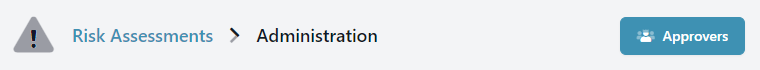
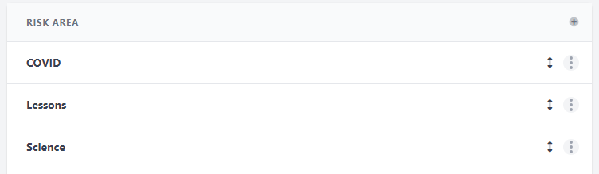

import UnderConstruction from '/snippets/construction.mdx';

<UnderConstruction/>

## Setup

1. An `Administrator` must enable the `Risk Assessment` Module in the Administration section of the system.

2. An `Administrator` should then assign the role of `Risk Assessment Manager` to one or more users of the system.

3. An `Administrator` or `Risk Assessment Manager` should assign the role of `Risk Assessment Approver` to at least one other member of staff. Doing so means that they can approve `Risk Assessments`.

4. `Risk Assessment Managers` can create new `Risk Areas`. These can be helpful for grouping `Risk Assessments` into themes e.g. "Science" or "Trips".

## Administration

> Under construction - sorry!
